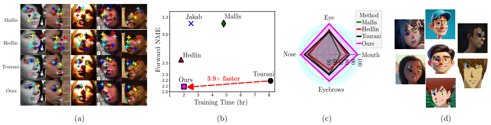
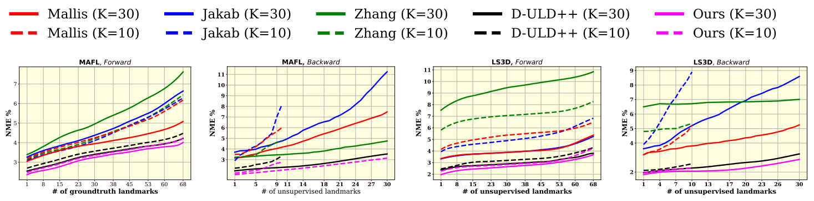
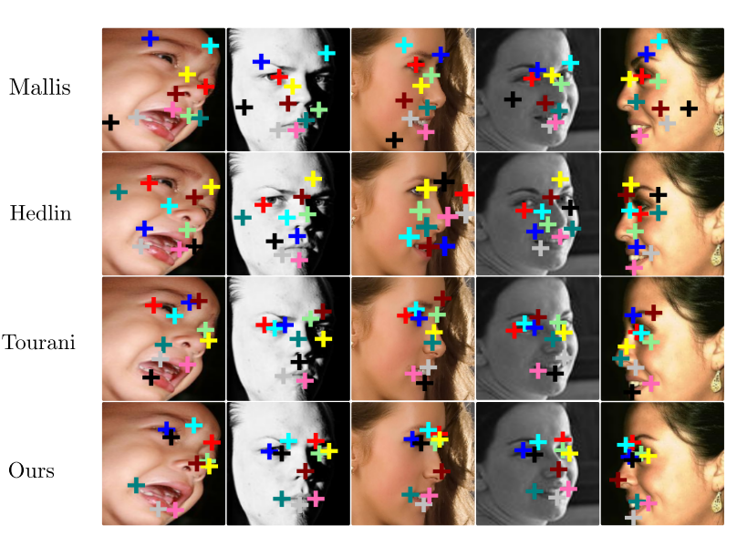
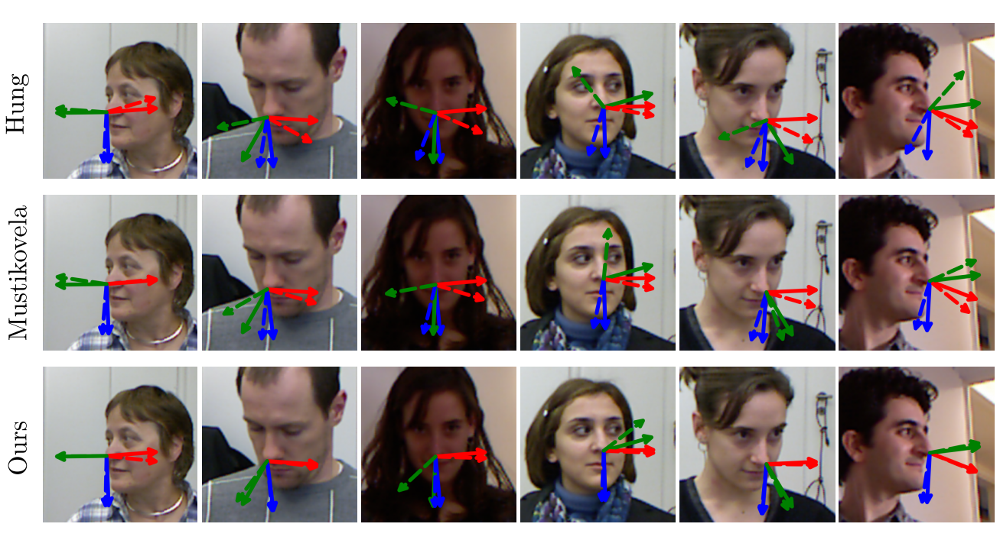

# Unsupervised Discovery of Facial Landmarks and Head Pose (CVPR 2025) 

Our contributions are summarized as follows:
  - We develop a new semantic-aware landmark localization algorithm, which features a novel landmark consistency evaluation technique.
  - We propose learning image-aware textual embedding to capture entire facial structure in the form of landmarks and their configuration.
  - We propose an unsupervised landmark-guided 3D head pose estimation algorithm which sets a new baseline in the unsupervised domain.
  - We present a novel 3D rendering-based augmentation and pose-based batching technique to further refine landmarks and consequently improve head-pose estimation especially across extreme facial orientations.
  - Our approach sets a new stateof-the-art in unsupervised facial landmark estimation across five public datasets: AFLW2000, MAFL, Cat-Heads, LS3D and a facial landmark tracking benchmark 300VW.

## ✍️ Authors  
- **[Satyajit Tourani](https://scholar.google.com/citations?user=943lKscAAAAJ&hl=en)**
- **[Siddharth Tourani](https://scholar.google.com/citations?user=D17zVs8AAAAJ&hl=en)**
- **[Arif Mahmood](https://scholar.google.com.pk/citations?user=_e6yGs4AAAAJ&hl=en)**
- **[Muhammad Haris Khan](https://scholar.google.com/citations?user=ZgERfFwAAAAJ&hl=en)**

## 📊 Main Results
#### Comparison of Face Alignment Methods

This table compares the performance of various face alignment methods on different datasets. The methods are categorized into Non-Diffusion and Diffusion-based approaches.

| Method             | MAFL  | MAFL  | AFLW  | AFLW  | LS3D  | LS3D  | CatHeads | CatHeads | 300VW  | 300VW  |
|---------------------|-------|-------|-------|-------|-------|-------|----------|----------|--------|--------|
| **Non-Diffusion** | F     | B     | F     | B     | F     | B     | F        | B        | F      | B      |
| Jakab         | 3.19  | 4.53  | 6.86  | 8.84  | 5.38  | 7.06  | 4.53     | 4.06     |        |        |
| Zhang           | 3.46  | 4.91  | 7.01  | 8.14  | 6.74  | 7.21  | 4.62     | 4.15     |        |        |
| Sanchez        | 3.99  | 14.74 | 6.69  | 25.84 | 26.41 | 5.44  | 4.42     | 4.17     | N.C.   | N.C.   |
| Mallis         | 3.19  | 4.23  | 7.37  | 8.89  | 6.53  | 6.57  | 9.31     | 10.08    |        |        |
| Awan            | 3.50  | 5.18  | 5.91  | 7.96  | 5.21  | 4.69  | 3.76     | 3.94     |        |        |
| **Diffusion** |       |       |       |       |       |       |          |          |        |        |
| Mallis (D)      | 2.74  | 3.11  | 3.38  | 3.75  | 2.89  | 3.76  | 3.14     | 3.62     | 5.24   | 7.09   |
| Hedlin         | 2.56  | 3.02  | 3.11  | 3.78  | 2.64  | 3.45  | 2.99     | 3.57     | 4.46   | 5.53   |
| Tourani        | 2.19  | 2.78  | 2.92  | 3.62  | 2.18  | 2.85  | 2.89     | 3.12     | 3.69   | 4.12   |
| **Ours** | **2.09**  | **2.62**  | **2.76**  | **3.54**  | **2.08**  | **2.73**  | **2.69**     | **3.01**     | **3.31**   | **3.89**   |
| **Improvement (%)** | +4.56%| +5.75%| +5.47%| +2.20%| +4.58%| +4.21%| +6.92%   | +3.52%   | +10.29%| +5.58% |

**Note:**
- F and B represent Forward and Backward NME
- N.C. stands for "Not Calculated".
#### Comparison of Head Pose Estimation Methods

This table compares the performance of various head pose estimation methods on the BIWI and AFLW2000 datasets.

| Method       | BIWI           |     BIWI         |      BIWI        |      BIWI        | AFLW2000       |         AFLW2000     | AFLW2000              |       AFLW2000       |
|--------------|----------------|--------------|--------------|--------------|----------------|--------------|--------------|--------------|
|              | Yaw (deg)      | Pitch (deg)  | Roll (deg)   | MAE (deg)    | Yaw (deg)      | Pitch (deg)  | Roll (deg)   | MAE (deg)    |
| Yang    | 4.64           | 5.61         | 3.57         | 4.61         | 4.83           | 6.25         | 4.94         | 5.34         |
| Dai      | 4.54           | 5.61         | 3.05         | 4.40         | 3.26           | 4.72         | 3.23         | 3.74         |
| Valle   | 3.98           | 4.61         | 2.39         | 3.66         | 3.34           | 4.69         | 3.48         | 3.83         |
| Hempel  | 3.23           | 5.32         | 2.78         | 3.78         | 3.27           | 4.58         | 2.98         | 3.61         |
| Nguyen  | 7.0            | 15.1         | 5.1          | 9.0          | 6.74           | 14.32        | 6.02         | 7.23         |
| Hung    | 15.7           | 13.8         | 7.3          | 12.3         | 16.4           | 14.5         | 7.6          | 13.4         |
| Musti   | 6.02           | 9.81         | 4.44         | 6.72         | 5.84           | 10.21        | 5.23         | 7.82         |
| **Ours** | **4.6** | **5.54** | **3.01** | **4.47** | **4.79** | **6.09** | **4.88** | **5.28** |
| **Improvement (%)** | **+23.58%** | **+43.52%** | **+32.20%** | **+33.48%** | **+17.97%** | **+40.35%** | **+6.69%** | **+26.97%** |

#### Cumulative Error Distribution (CED) Curves

#### Landmark Estimation (Qualitative Analysis)

#### Head Pose Estimation (Qualitative Analysis)

## Code
Coming soon...
